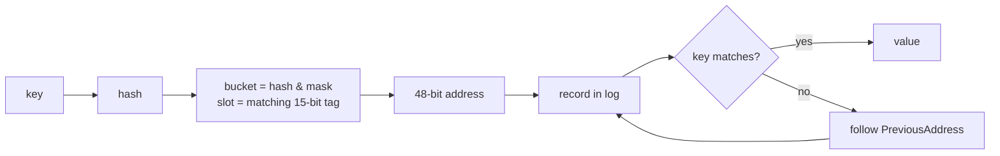
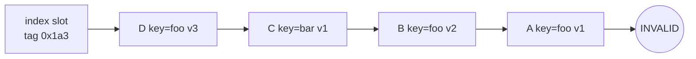
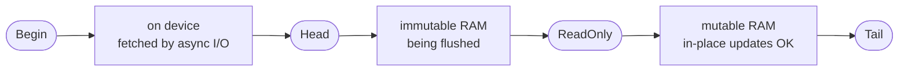
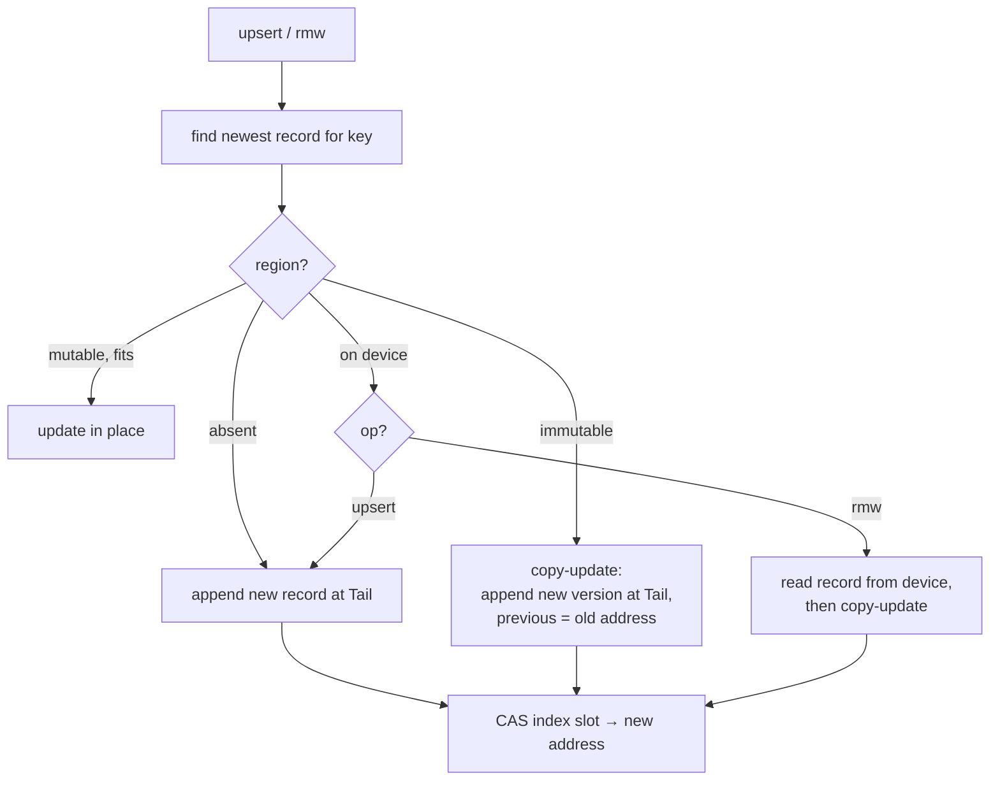
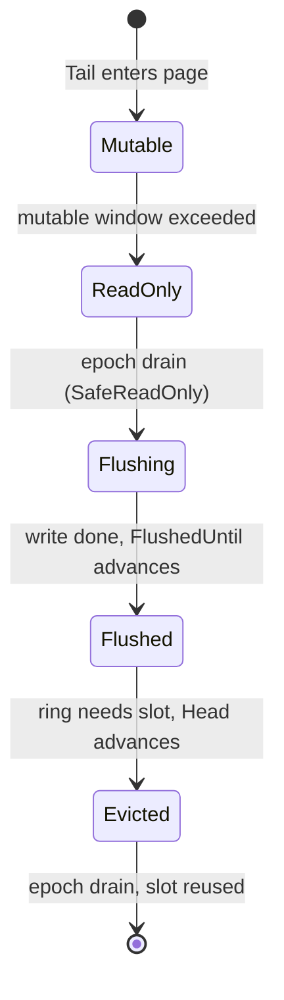
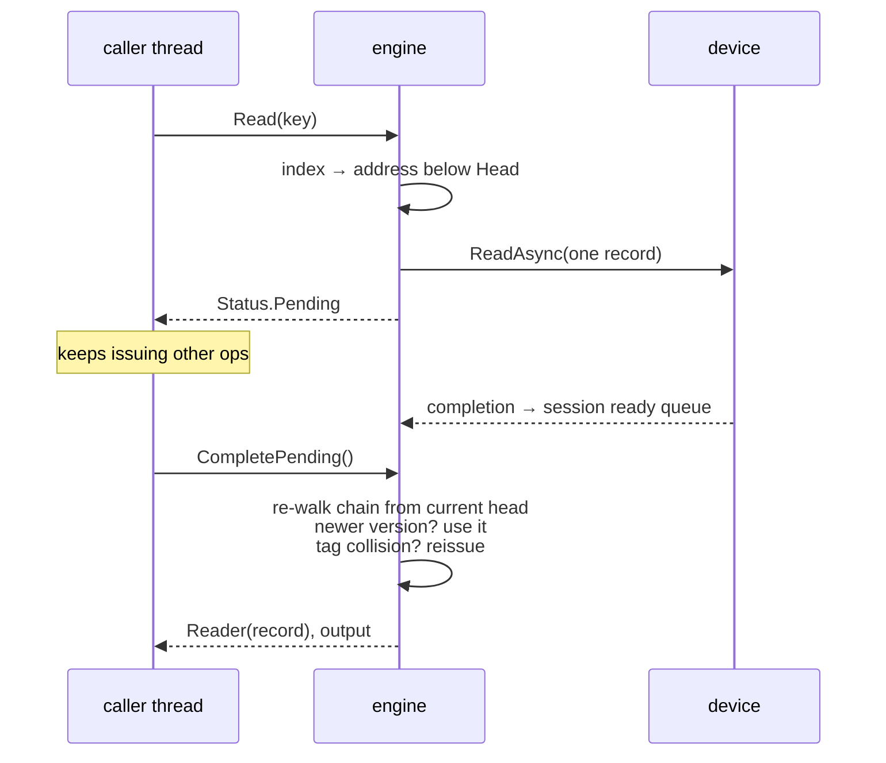
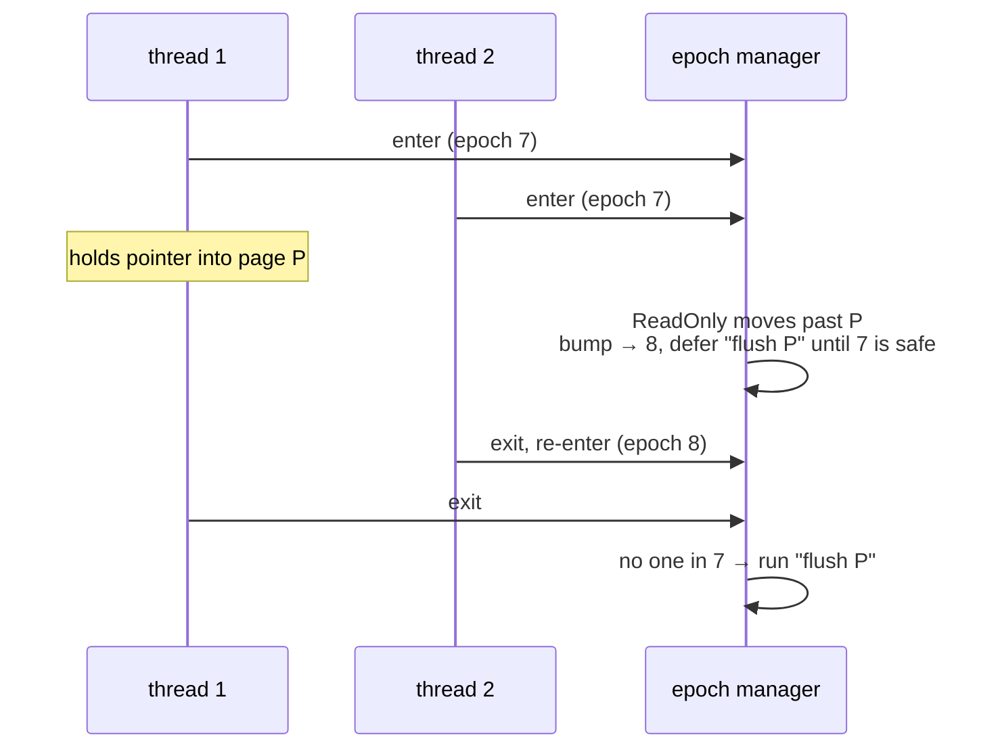
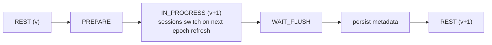
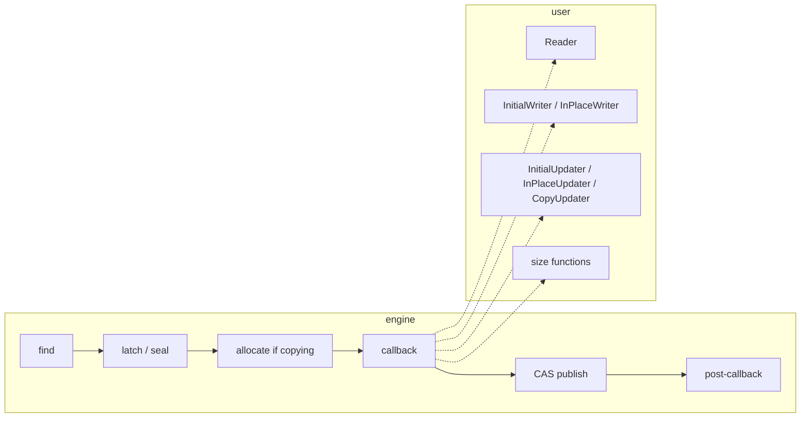

# tsavorite overview

Tsavorite is a **hash index over a hybrid log**. The index maps a hash to the
address of the newest record; records chain backward; the log is one address
space whose tail is mutable RAM, middle is immutable RAM, and oldest part is on
disk. Hot records are updated in place, everything else is copied to the tail.
Cold reads are asynchronous and the caller resumes them.

> Source: `microsoft/garnet` @ `c9607605baa4`, `libs/storage/Tsavorite/cs/src/core/`.
> Reference-only. See [`../design/`](../design/) for what we build.

---

## 1. the index points into the log; keys live in the log

An index entry is one 8-byte word: `[tentative:1][tag:15][address:48]`. A bucket
is one 64-byte cache line: 7 entries + 1 overflow/latch word. The index never
stores a key and is sized once, up front.

## 2. one chain, two jobs

`PreviousAddress` links every record to the prior record with the same tag. The
chain holds **old versions** (B, A) and **other keys** (C). Newest is at the head,
so `get(foo)` stops at D and never sees B or A. Delete appends a tombstone.

## 3. one address space, three regions

Addresses are 48-bit logical offsets that never change. Where an address falls
relative to `Head` and `ReadOnly` decides how an operation treats the record.

## 4. hot in place, cold by copy

Upsert never reads the old value, so it never touches the device. RMW must.
New records are written invalid, published by CAS, then marked valid; a lost CAS
retries.

## 5. memory is a ring holding the newest pages

Page `p` lives in slot `p % ring_size`, so RAM always holds a contiguous suffix of
the log. Old pages are never paged back in; a cold read fetches one record. To
make a cold record hot again, copy it to the tail (or into the read cache, a
second memory-only log spliced into the same chains).

## 6. cold reads are pending; the caller resumes them

No user code runs on the I/O thread. Every completion is re-validated against
the live index because another thread may have appended a newer version while
the read was in flight.

## 7. epochs make boundary moves safe

Every operation runs inside an epoch. Anything that could invalidate a pointer
another thread holds (advancing `ReadOnly`, evicting a page, reusing a slot,
switching checkpoint phase) is a deferred action that runs after all threads
leave the old epoch. Threads run deferred actions cooperatively on entry.

## 8. concurrency: CAS to publish, short latches to mutate

| mechanism | scope | for |
|---|---|---|
| CAS on index entry | one slot | publishing a new chain head |
| bucket latch (in the 8th word) | one bucket | protecting in-place update / RMW |
| `Sealed` bit on record | one record | telling late writers "replaced, retry at new head" |
| hashed lock table | one key | multi-key transactions |

Not lock-free, deliberately: in-place RMW on a shared record needs exclusion.

## 9. checkpoint = version bump while running

Records written under `v+1` carry a version bit; recovery to `v` drops them.
Fold-over checkpoints flush the mutable region; snapshot checkpoints copy it to a
separate file and keep it mutable. Recovery rebuilds the index by scanning the
log (or loads an index snapshot). Durability is per checkpoint, not per write.

## 10. the user supplies the operation, the engine supplies atomicity

The engine hands the callback the record memory (or the source and a freshly
allocated destination). Post-callbacks run only after the CAS succeeded, so side
effects are never performed for lost races.

---

## what it is not

- **Not ordered.** No range scans; the index is a hash.
- **Not a page cache.** Memory holds the newest suffix; misses read one record.
- **Not per-write durable.** Durable at checkpoints; Garnet adds an AOF on top.
- **Not lock-free.** CAS for publication, latches for mutation.

## where to look

| idea | file (under `cs/src/core/`) |
|---|---|
| index entry, bucket | `Index/Tsavorite/HashBucketEntry.cs`, `HashBucket.cs` |
| chain walk | `Index/Tsavorite/Implementation/FindRecord.cs` |
| record header | `Index/Common/RecordInfo.cs`, `Allocator/RecordDataHeader.cs` |
| ring, boundaries, flush | `Allocator/AllocatorBase.cs`, `Index/Tsavorite/LogAccessor.cs` |
| read / upsert / rmw | `Index/Tsavorite/Implementation/Internal{Read,Upsert,RMW}.cs` |
| pending I/O | `Implementation/ContinuePending.cs`, `Index/Tsavorite/TsavoriteThread.cs` |
| epochs | `Epochs/LightEpoch.cs` |
| checkpoint | `Index/Checkpointing/StateMachineDriver.cs`, `Index/Recovery/Recovery.cs` |
| callbacks | `Index/Interfaces/ISessionFunctions.cs` |
