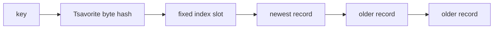

# Grossular 0.1

Grossular 0.1 implements the smallest useful part of Tsavorite: a fixed hash
index whose entries point into one append-only log.



## Components

- `Address`: an opaque 47-bit logical log address. Address 0 is invalid and the
  first record starts at address 64.
- `RecordRef`: a borrowed view over an encoded record containing its previous
  address, key, and value.
- `Log`: one `Vec<u8>` containing aligned records in append order.
- `Index`: a fixed power-of-two `Vec<Address>` containing one chain head per
  bucket.
- `Store`: connects the Tsavorite byte hash, index, and log through `get` and
  `upsert`.

## Operations

An upsert is a blind append:

```text
hash key
read current bucket head
append { previous: old head, key, value }
replace bucket head with the new address
```

A get walks backward until the complete key matches:

```text
hash key
start at the bucket head
while the address is valid:
    read the record
    if its key matches, return its value
    otherwise follow its previous address
return not found
```

Different keys in the same bucket and older versions of one key share the same
chain. The first matching record is always the newest value.

## Invariants

1. Every index slot is invalid or points to the newest record in its chain.
2. Every valid `previous` address is smaller than its record's address.
3. Every record begins at an 8-byte-aligned address.
4. Only `Log` interprets an address as an in-memory offset.
5. Index collisions affect lookup cost, not correctness.

## Scope

Included: byte keys and values, aligned record encoding, one global in-memory
log, a fixed index, blind upsert, chain-walking get, and tests against a
`HashMap` reference model.

Deferred: delete/tombstones, hash tags, multi-entry buckets, concurrency,
in-place updates, bounded pages, devices, checkpointing, recovery, and
compaction.

## Completion

The unit suite covers address validation, fixed Tsavorite hash vectors, record
encoding, log chains, index collisions, and store behavior. The integration
suite runs the same deterministic randomized operation trace against Grossular
and `HashMap` with 1, 16, and 1024 index buckets.
