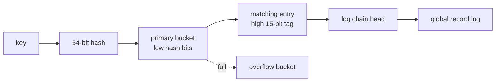
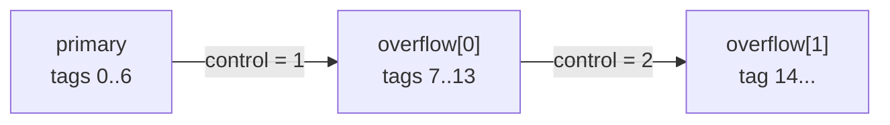

# Grossular 0.2

Grossular 0.2 replaces v0.1's single chain head per index bucket with
Tsavorite-style cache-line buckets. Each bucket holds seven packed tag/address
entries and an overflow link.

## Index lookup



The low hash bits select one primary bucket. The high 15 bits form a tag used to
select an entry within that bucket. Complete keys remain in the log and are
still compared while walking the selected record chain.

## Packed entry

Each `HashEntry` is one 64-bit word:

```text
63             48 47                              0
┌────────────────┬─────────────────────────────────┐
│ T │ 15-bit tag │       address field             │
└────────────────┴─────────────────────────────────┘
```

- `T` is reserved for concurrent insertion in a later version.
- Bit 47 is reserved for a future read-cache address marker.
- The remaining low bits contain the absolute log address.
- Word zero represents an empty entry.

## Cache-line bucket

```text
┌────────┬────────┬────────┬────────┬────────┬────────┬────────┬─────────┐
│ entry0 │ entry1 │ entry2 │ entry3 │ entry4 │ entry5 │ entry6 │ control │
└────────┴────────┴────────┴────────┴────────┴────────┴────────┴─────────┘
   8 B      8 B      8 B      8 B      8 B      8 B      8 B      8 B
```

`Bucket` is exactly 64 bytes and aligned to 64 bytes. A lookup normally reads
one cache line. The control word currently stores an overflow link; its upper
bits remain available for future shared/exclusive latch state.

## Overflow buckets

When seven distinct tags map to one primary bucket, the next distinct tag is
placed in an overflow bucket of the same shape.



Overflow buckets live in an index-owned arena. Links are encoded as one-based
indexes so zero means no overflow:

```text
control = 0       no overflow
control = N + 1   overflow[N]
```

The arena uses indexes rather than pointers, so moving its backing `Vec` is safe
in this single-threaded version.

## Tag and record chains

Different tags in one bucket have independent heads. Keys with the same bucket
and tag share one log chain and are distinguished by complete-key comparison.

```text
bucket
├── tag A -> address 300 -> address 120
├── tag B -> address 240 -> address 80
└── tag C -> address 190
```

Changing a tag's head replaces only its packed entry. The global append-only log
and its backward `previous` links are unchanged.

## What changed from v0.1

```text
v0.1: hash -> bucket -> one chain for every key in the bucket
v0.2: hash -> bucket -> tag entry -> one chain for that tag
```

`Store::get` and `Store::upsert` did not change. Only the index implementation
became more selective.

## Invariants

1. `HashEntry` is exactly 8 bytes.
2. `Bucket` is exactly 64 bytes and 64-byte aligned.
3. A bucket contains at most one entry for a given tag.
4. Updating one tag cannot change another tag's head.
5. Overflow links contain indexes into the overflow arena, never log addresses.
6. Missing tags return `Address::INVALID`.

## Completion

Tests cover packed-entry round trips, maximum tags, cache-line layout, seven
primary entries, one-based overflow encoding, independent and shared tags, and
multiple overflow buckets. The unchanged v0.1 store correctness suite confirms
that tag selection and overflow do not affect key-value behavior.

## Deferred

- atomic entry publication and the tentative bit;
- bucket latches;
- a stable chunked overflow allocator for concurrent readers;
- online index resizing;
- read-cache addresses;
- tombstones and the Tsavorite record header;
- mutable/read-only log regions.
