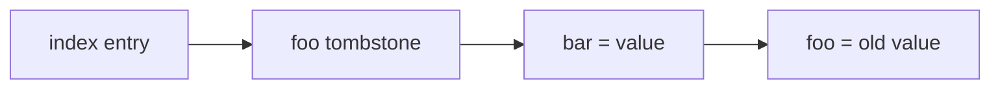

# Grossular 0.3

Grossular 0.3 replaces the initial record header with Tsavorite's two packed
metadata words and uses the first record-state flag to implement deletion with
tombstones.

## Record layout

The header remains 16 bytes:

```text
┌───────────────────────────┬───────────────────────────┐
│ RecordInfo: 8 bytes       │ RecordDataHeader: 8 bytes │
└───────────────────────────┴───────────────────────────┘
│ key bytes │ value bytes │ alignment padding │
```

`RecordInfo` stores the previous logical address and record state:

```text
63       53 52     51       50      49    48 47              0
┌─────────┬───────┬────────┬───────┬─────┬────┬────────────────┐
│reserved │sealed │modified│version│valid│tomb│ previous addr  │
└─────────┴───────┴────────┴───────┴─────┴────┴────────────────┘
```

`RecordDataHeader` describes the payload:

```text
63      56 55       48 47             24 23       14 13         6 5      0
┌─────────┬───────────┬─────────────────┬───────────┬────────────┬────────┐
│namespace│record type│ value length    │ key length│filler words│ flags  │
└─────────┴───────────┴─────────────────┴───────────┴────────────┴────────┘
```

Only inline byte keys and values are supported. The inline flags tell the
decoder that the actual bytes follow the header rather than living in external
object storage. Keys are limited to 1,022 bytes and values to 16,777,214 bytes
until overflow storage is implemented.

## Tombstones

Delete is represented by appending another record, not removing old bytes:



`Store::get` stops at the first matching key. If that record is a tombstone, the
key is absent; it must not continue to an older value.

`Store::delete`:

```text
find the newest matching record
if missing or already tombstoned, return false
append a tombstone whose previous address is the current tag-chain head
replace the index head and return true
```

The tombstone links to the tag-chain head rather than directly to the matching
record so colliding keys between them remain reachable. A later upsert appends a
normal value above the tombstone and makes the key visible again.

## What changed from v0.2

- The record header still occupies 16 bytes, but now carries a Tsavorite-shaped
  inline subset of its layout and state fields.
- Record lengths are derived from `RecordDataHeader` and include alignment and
  filler capacity.
- `RecordRef` exposes semantic accessors for previous address and tombstone
  state; record extent is derived internally from `RecordDataHeader`.
- `Log` can append value records and tombstone records.
- `Store` now supports `delete` and avoids decoding the matching record twice.
- The cache-line hash index and global append-only log are otherwise unchanged.

## Invariants

1. `RecordInfo` and `RecordDataHeader` are each exactly 8 bytes.
2. Record state bits never overlap the 48-bit previous-address field.
3. A newly appended tombstone contains a key and no value; a future in-place
   tombstone may retain its old allocation as filler.
4. An empty value record is not a tombstone.
5. A matching tombstone hides every older value for that key.
6. Record extent remains 8-byte aligned and includes explicit filler words.

## Completion

Unit tests cover both packed words, exact bit positions, inline limits, aligned
record lengths, filler, value/tombstone round trips, deletion, reinsertion, and
colliding keys. The reference-model suite mixes get, upsert, and delete across
1, 16, and 1,024 index buckets and compares Grossular with `HashMap`.

## Deferred

- overflow key and value storage;
- in-place updates and filler consumption;
- mutable and read-only log regions;
- fixed-size pages;
- atomic valid/sealed transitions;
- checkpoint versions;
- expiration, ETags, record types, and namespaces.
